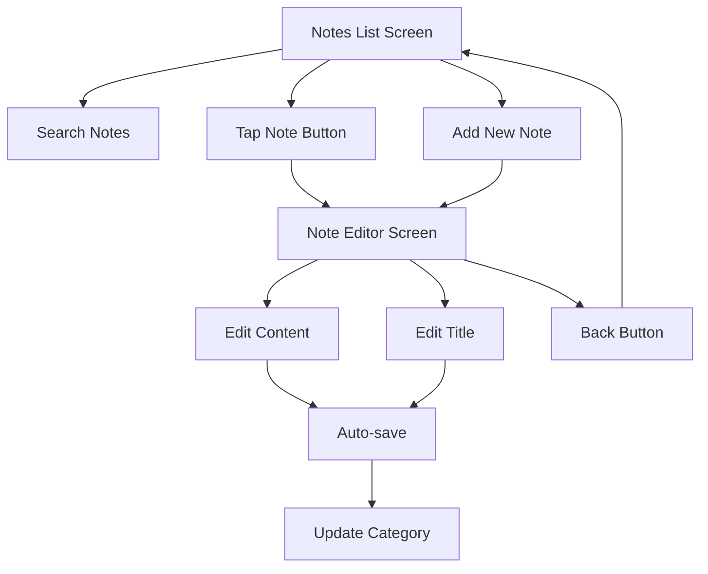

# SaveMyMind - Product Requirements Document

## 1. Product Overview

SaveMyMind is a React Native notes application that provides users with an intuitive, categorized note-taking experience. The app organizes notes automatically by date categories and offers seamless navigation between a categorized list view and individual note editing.

The application solves the problem of scattered note-taking by providing automatic organization and quick access to notes based on when they were created or modified. Target users include students, professionals, and anyone who needs to capture and organize thoughts quickly on mobile devices.

## 2. Core Features

### 2.1 User Roles

This application does not require user role distinction as it focuses on personal note-taking functionality.

### 2.2 Feature Module

Our SaveMyMind application consists of the following main screens:

1. **Notes List Screen**: categorized note sections, search functionality, note creation button
2. **Note Editor Screen**: text editor, note title display, navigation controls, auto-save functionality

### 2.3 Page Details

| Page Name | Module Name | Feature description |
|-----------|-------------|---------------------|
| Notes List Screen | Category Sections | Display notes organized in date-based categories: Today, Yesterday, This week, This month, Older. Sort notes by newest first within each category. |
| Notes List Screen | Search Bar | Filter notes by title using real-time search. Maintain search state when navigating between screens. |
| Notes List Screen | Note Buttons | Display each note as a clickable button showing the note title. Navigate to editor when tapped. |
| Notes List Screen | Add Note Button | Create new notes with default "New note" title and current timestamp. |
| Note Editor Screen | Text Editor | Multi-line text input for note content with auto-save functionality on text changes. |
| Note Editor Screen | Title Display | Show note title centered at the top of the screen with editing capability. |
| Note Editor Screen | Navigation | Back button in top-left corner to return to notes list while preserving search filter. |
| Note Editor Screen | Auto-categorization | Automatically update note category based on modification timestamp when saving. |

## 3. Core Process

**Main User Flow:**
1. User opens the app and sees the categorized notes list
2. User can search for specific notes using the search bar
3. User taps on an existing note to open the editor
4. User edits the note content and title
5. Changes are automatically saved with updated timestamp
6. User taps back button to return to the categorized list
7. Note appears in the appropriate date category based on modification time

**New Note Creation Flow:**
1. User taps the add note button from the list screen
2. App creates a new note with default title "New note"
3. Note editor opens with empty content
4. User edits title and content
5. Note is automatically saved and categorized under "Today"

## 4. User Interface Design

### 4.1 Design Style

- **Primary Colors**: Blue (#007AFF) for interactive elements, Gray (#F2F2F7) for backgrounds
- **Secondary Colors**: Light gray (#E5E5EA) for separators, Dark gray (#3C3C43) for text
- **Button Style**: Rounded corners with subtle shadows, flat design with clear tap targets
- **Font**: System font (San Francisco on iOS, Roboto on Android) with sizes 16px for body text, 20px for titles
- **Layout Style**: Clean list-based design with clear section headers and consistent spacing
- **Icons**: Simple, outlined icons for navigation and actions

### 4.2 Page Design Overview

| Page Name | Module Name | UI Elements |
|-----------|-------------|-------------|
| Notes List Screen | Search Bar | Fixed at top with rounded corners, light gray background, search icon, placeholder text "Search notes..." |
| Notes List Screen | Category Headers | Bold text labels for each date category, left-aligned with consistent spacing |
| Notes List Screen | Note Buttons | Full-width buttons with note title, subtle border, tap highlight effect |
| Notes List Screen | Add Button | Floating action button in bottom-right corner with plus icon, primary blue color |
| Note Editor Screen | Header | Clean white background with centered title text and left-aligned back arrow |
| Note Editor Screen | Text Editor | Full-screen text area with comfortable padding, auto-focus on new notes |

### 4.3 Responsiveness

The application is designed mobile-first with touch-optimized interactions. All buttons have minimum 44px touch targets, and the interface adapts to different screen sizes while maintaining consistent spacing and readability.