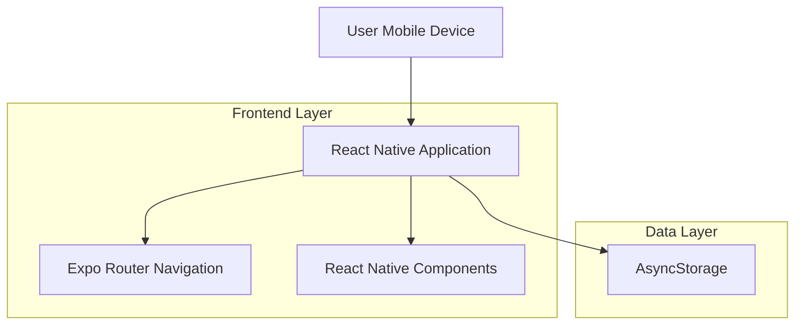
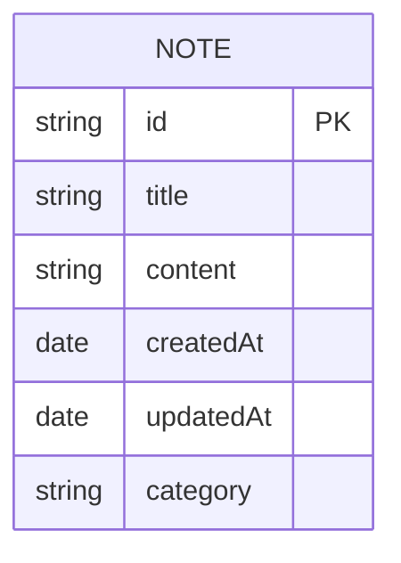
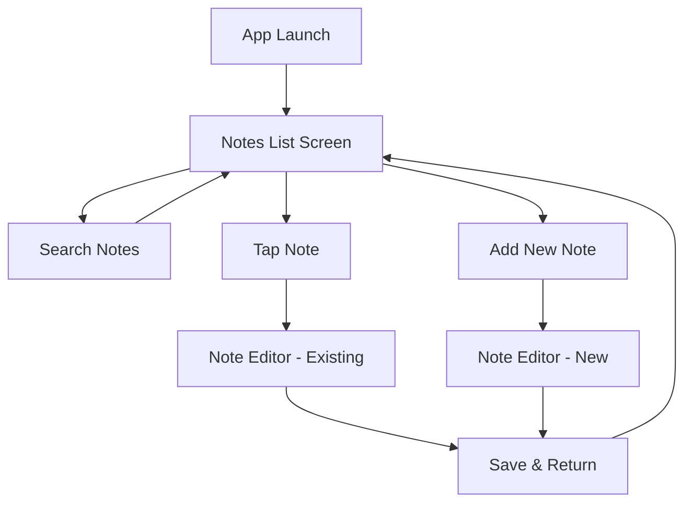

# SaveMyMind - Technical Architecture Document

## 1. Architecture Design



## 2. Technology Description

* Frontend: React Native\@0.79.6 + Expo\@53 + TypeScript\@5.8.3

* Navigation: Expo Router\@5.1.5 (Stack Navigation)

* Storage: AsyncStorage (built-in React Native)

* Styling: React Native StyleSheet + Expo Symbols for icons

## 3. Route Definitions

| Route               | Purpose                                                                |
| ------------------- | ---------------------------------------------------------------------- |
| /notes              | Main notes list screen with categorized notes and search functionality |
| /notes/editor/\[id] | Note editor screen for editing existing notes                          |
| /notes/editor/new   | Note editor screen for creating new notes                              |

## 4. Data Model

### 4.1 Data Model Definition



### 4.2 Data Definition Language

**Note Interface (TypeScript)**

```typescript
interface Note {
  id: string;
  title: string;
  content: string;
  createdAt: Date;
  updatedAt: Date;
  category: 'today' | 'yesterday' | 'thisWeek' | 'thisMonth' | 'older';
}

interface NotesState {
  notes: Note[];
  searchQuery: string;
  filteredNotes: Note[];
}
```

**Storage Schema**

```typescript
// AsyncStorage Keys
const STORAGE_KEYS = {
  NOTES: '@SaveMyMind:notes',
  SEARCH_QUERY: '@SaveMyMind:searchQuery'
};

// Sample Data Structure
const sampleNotes: Note[] = [
  {
    id: 'uuid-1',
    title: 'Meeting Notes',
    content: 'Discussed project timeline and deliverables...',
    createdAt: new Date('2024-01-15T10:00:00Z'),
    updatedAt: new Date('2024-01-15T10:30:00Z'),
    category: 'today'
  }
];
```

## 5. Component Architecture

### 5.1 Core Components

**NotesListScreen Component**

* Manages notes state and search functionality

* Renders categorized sections with note buttons

* Handles navigation to editor screen

**NoteEditorScreen Component**

* Manages individual note editing

* Auto-saves changes to AsyncStorage

* Updates note timestamps and categories

**CategorySection Component**

* Renders notes grouped by date category

* Handles empty state display

**SearchBar Component**

* Real-time search filtering

* Persists search state across navigation

### 5.2 Utility Functions

```typescript
// Date categorization logic
function categorizeNoteByDate(date: Date): string {
  const now = new Date();
  const noteDate = new Date(date);
  
  // Implementation for categorizing notes by date
  // Returns: 'today', 'yesterday', 'thisWeek', 'thisMonth', 'older'
}

// Note sorting function
function sortNotesByDate(notes: Note[]): Note[] {
  return notes.sort((a, b) => 
    new Date(b.updatedAt).getTime() - new Date(a.updatedAt).getTime()
  );
}

// Search filtering
function filterNotesByQuery(notes: Note[], query: string): Note[] {
  return notes.filter(note => 
    note.title.toLowerCase().includes(query.toLowerCase())
  );
}
```

## 6. Navigation Structure

### 6.1 Stack Navigation Setup

```typescript
// app/_layout.tsx - Root layout with stack navigation
export default function RootLayout() {
  return (
    <Stack>
      <Stack.Screen name="notes" options={{ headerShown: false }} />
      <Stack.Screen 
        name="notes/editor/[id]" 
        options={{ 
          headerShown: true,
          title: 'Edit Note',
          headerBackTitle: 'Notes'
        }} 
      />
    </Stack>
  );
}
```

### 6.2 Navigation Flow



## 7. State Management

### 7.1 Local State with React Hooks

```typescript
// Custom hook for notes management
function useNotes() {
  const [notes, setNotes] = useState<Note[]>([]);
  const [searchQuery, setSearchQuery] = useState('');
  
  // Load notes from AsyncStorage
  const loadNotes = async () => {
    // Implementation
  };
  
  // Save notes to AsyncStorage
  const saveNotes = async (updatedNotes: Note[]) => {
    // Implementation
  };
  
  // Add new note
  const addNote = async (note: Omit<Note, 'id' | 'createdAt' | 'updatedAt'>) => {
    // Implementation
  };
  
  // Update existing note
  const updateNote = async (id: string, updates: Partial<Note>) => {
    // Implementation
  };
  
  return {
    notes,
    searchQuery,
    setSearchQuery,
    loadNotes,
    addNote,
    updateNote
  };
}
```

## 8. Performance Considerations

### 8.1 Optimization Strategies

* **Lazy Loading**: Notes are loaded from AsyncStorage on app startup

* **Debounced Search**: Search queries are debounced to prevent excessive filtering

* **Memoization**: Category sections and filtered results are memoized

* **Auto-save Throttling**: Note content changes are throttled to prevent excessive storage writes

### 8.2 Storage Management

* Notes are stored as JSON in AsyncStorage

* Search query persistence for better UX

* Automatic cleanup of empty notes

* Backup and restore functionality for data safety

